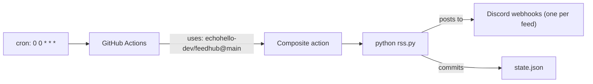

# feeds

My personal RSS feeds piped to Discord, powered by [echohello-dev/feedhub](https://github.com/echohello-dev/feedhub).

This repo is **just config + state**. The worker code lives in `feedhub`; this repo's only job is to call it and provide `feeds.json` + `state.json`.

## What's watched

See [`feeds.json`](feeds.json). Each feed posts to its own Discord channel.

- **OpenRouter - New Models** — every new model added to [openrouter.ai/models](https://openrouter.ai/models). `DISCORD_WEBHOOK_OPENROUTER`.
- **Model Context Protocol Blog** — posts from [blog.modelcontextprotocol.io](https://blog.modelcontextprotocol.io). `DISCORD_WEBHOOK_MCP`.
- **Johnny Huynh Blog** — posts from [johnnyhuy.com](https://johnnyhuy.com). `DISCORD_WEBHOOK_BLOGS`.
- **Free Sauce - videos and articles** — videos and articles from [frees.au](https://www.frees.au). `DISCORD_WEBHOOK_BLOGS` (shared channel with Johnny Huynh).

## How it runs

`.github/workflows/rss.yml` calls the [feedhub composite action](https://github.com/echohello-dev/feedhub) daily. The worker diffs each feed against `state.json`, posts new items to its matching Discord webhook, and commits the updated state.



## Setup

Webhook URLs live as GitHub Actions secrets — never in a file. One per webhook channel:

```
gh secret set DISCORD_WEBHOOK_OPENROUTER --repo echohello-dev/feeds
gh secret set DISCORD_WEBHOOK_MCP --repo echohello-dev/feeds
gh secret set DISCORD_WEBHOOK_BLOGS --repo echohello-dev/feeds
```

Then trigger the workflow manually the first time to seed `state.json`:

```
mise run trigger
```

Local commands go through mise (`mise tasks`). `mise run seed` marks current items seen without posting.

## Adding a new feed

1. Append an entry to `feeds.json` (see [the template's examples](https://github.com/echohello-dev/feedhub/blob/main/examples/feeds.example.json) for the schema). `webhook_secret` is the env-var name, not the URL.
2. Either reuse an existing secret or set a new one: `gh secret set DISCORD_WEBHOOK_<NAME> --repo echohello-dev/feeds`.
3. Add a matching job `env` line in `.github/workflows/rss.yml` if you introduced a new secret.
4. Seed before the first real post, or the backlog floods the channel: `mise run seed`.

## Tuning cadence

Edit the cron in `.github/workflows/rss.yml`. Daily (`0 0 * * *`) is the default. Hourly or `*/15` if you want faster; `*/5` works on public repos (free Actions minutes). Anything sub-5-min breaks the GitHub Actions floor.

## Pinning the action

`.github/workflows/rss.yml` references `echohello-dev/feedhub@main`. For production, replace `@main` with a tag or commit SHA so feedhub updates don't break this consumer silently.
