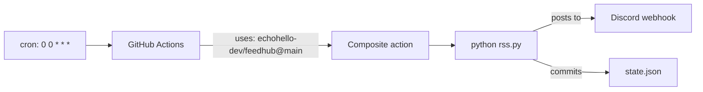

# feeds

My personal RSS feeds piped to Discord, powered by [echohello-dev/feedhub](https://github.com/echohello-dev/feedhub).

This repo is **just config + state**. The worker code lives in `feedhub`; this repo's only job is to call it and provide `feeds.json` + `state.json`.

## What's watched

See [`feeds.json`](feeds.json). Currently:

- **OpenRouter - New Models** — every new model added to [openrouter.ai/models](https://openrouter.ai/models). Posts to a Discord channel via the `DISCORD_WEBHOOK_OPENROUTER` secret.

## How it runs

`.github/workflows/rss.yml` calls the [feedhub composite action](https://github.com/echohello-dev/feedhub) daily. The worker diffs the feed against `state.json`, posts new items, commits the updated state.



## Setup

This repo is private. The webhook URL is stored as a GitHub Actions secret (`DISCORD_WEBHOOK_OPENROUTER`) — never in a file. To set it:

```
gh secret set DISCORD_WEBHOOK_OPENROUTER --repo echohello-dev/feeds
```

Then trigger the workflow manually the first time to seed `state.json`:

```
gh workflow run rss.yml --repo echohello-dev/feeds
```

## Adding a new feed

1. Add an entry to `feeds.json` (see [the template's examples](https://github.com/echohello-dev/feedhub/blob/main/examples/feeds.example.json) for the schema).
2. Add the corresponding webhook secret — `gh secret set DISCORD_WEBHOOK_<NAME> --repo echohello-dev/feeds`.
3. Add a matching job `env` line in `.github/workflows/rss.yml`.
4. Push. Next workflow run picks it up.

## Tuning cadence

Edit the cron in `.github/workflows/rss.yml`. Daily (`0 0 * * *`) is the default. Hourly or `*/15` if you want faster; `*/5` works on public repos (free Actions minutes). Anything sub-5-min breaks the GitHub Actions floor.

## Pinning the action

`.github/workflows/rss.yml` references `echohello-dev/feedhub@main`. For production, replace `@main` with a tag or commit SHA so feedhub updates don't break this consumer silently.
